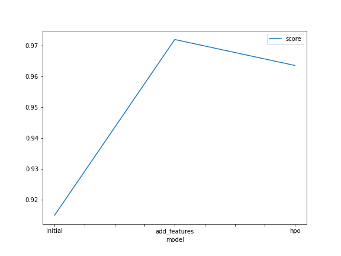
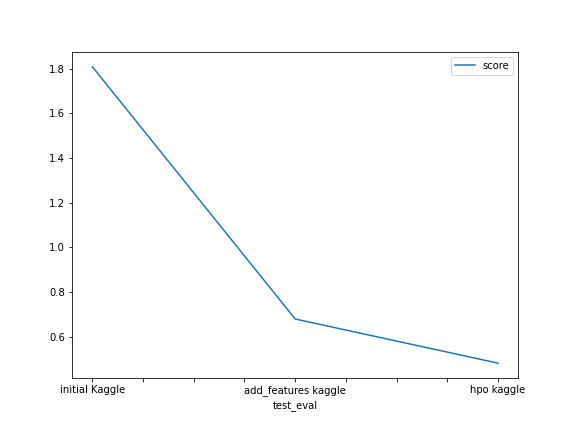

# Report: Predict Bike Sharing Demand with AutoGluon Solution
#### INTI ERNESTO LUNA AVILES

## Initial Training
### What did you realize when you tried to submit your predictions? What changes were needed to the output of the predictor to submit your results?
Predictions were float type values so I had to round them and then transform then to integer.
Later on, submission example was used to replace count column with prediction values.
Finally, a csv file was saved and then submit it to kaggle.

### What was the top ranked model that performed?
Best models and R2 in order were:
1.WeightEnsemble_L3        0.915 
2.Random ForestMSE_BAG_L2   0.913
3.ExtraTreesMSE_BAG_L2      0.911

In Kaggle, public and private score was 1.80903

## Exploratory data analysis and feature creation
### What did the exploratory analysis find and how did you add additional features?
New features such as month, day and hour, some clear patterns of peak in demand were seen. In addition some variables (season and weather type) were transformed to category type so the model can treat them properly.

### How much better did your model preform after adding additional features and why do you think that is?
Best model and R2 values were:
WeightedEnsemble_L3    0.972118      
CatBoost_BAG_L2        0.971708     
LightGBM_BAG_L2        0.971411     

In Kaggle, public and private score was 0.67887

## Hyper parameter tuning
### How much better did your model preform after trying different hyper parameters?
I tried different parameters and my model performance did not improve compared to the model 2 with new features and default parameters using the train dataset. I kept the same time in order to compare with previous models settings.However, it did improve when submitted to kaggle having a score of 0.48107.

The different optios are were:
1. Tuning CATBoost produced some errors and a lot of time it was trying to solved the issues. Apparently the cause was bad syntax or parameter configuration.
2. I tried num_trial 6 and search strategy as random along with gbm model parameter but results were 0.95 so lower than without hyperparameter.
3. I tried leaving the same gbm parameters but reducing num_trials to 3 and best model got in 0.96.
4. I changed the search strategy to auto
5. I changed the number of trees to 125 and leaves to 150

With all these changes. WeightedEnsemble_L3 and LightGBM were the best models.

### If you were given more time with this dataset, where do you think you would spend more time?
I would spend more time trying to check if new features could be created and also checking what were the best parameters the top models were using when obtaining best results to understand the effect of hyperparameter tuning.

### Create a table with the models you ran, the hyperparameters modified, and the kaggle score.
|model|score|
|--|--|
|initial|1.80903|
|add_features|0.67887|
|hpo|0.48107|

### Table with train score for different hpo
|model|num_trials|search_strategy|num_trees|num_boost_round|score|
|--|--|--|--|--|--|
|hpo1| 	6 	|random |default	|100 	|0.952010|
|hpo2| 	3 	|random |default 	|100 	|0.960102|
|hpo3| 	3 	|auto 	|default 	|100 	|0.960352|
|hpo4| 	2 	|auto 	|125     	|150 	|0.963580|

Configuration used in last hpo test:

'''

num_trials = 2  
search_strategy = 'auto' 

gbm_options = {  # specifies non-default hyperparameter values for lightGBM gradient boosted trees
    'num_boost_round': 150,  # number of boosting rounds (controls training time of GBM models)
    'num_leaves': ag.space.Int(lower=20, upper=50, default=30),
    'num_trees':125
}

hyperparameters = {  # hyperparameters of each model type
                   'GBM': gbm_options
                   #'CAT': cat_options, 
                  } 
hyperparameter_tune_kwargs = {  # HPO is not performed unless hyperparameter_tune_kwargs is specified
    'num_trials': num_trials,
    'scheduler' : 'local',
    'searcher': search_strategy,
}                  
predictor_new_hpo = TabularPredictor(label='count', eval_metric="r2").fit(
    train, presets='best_quality',
    time_limit=600,
    hyperparameters=hyperparameters,
    hyperparameter_tune_kwargs=hyperparameter_tune_kwargs
)

'''
-----------------------------------------------------------
### Create a line plot showing the top model score for the three (or more) training runs during the project.

TODO: Replace the image below with your own.

### Create a line plot showing the top kaggle score for the three (or more) prediction submissions during the project.

TODO: Replace the image below with your own.

## Summary
In this project we used autogluon library to test many different algorithms for a regression problem which was very fast with minimal effort obtaining very good results. As we explored the data and created logical interesting features, the results obtained by the model were improved. Further tuning can improve the results, however, it requires a good understanding and testing of the different parameters and the data used. 
